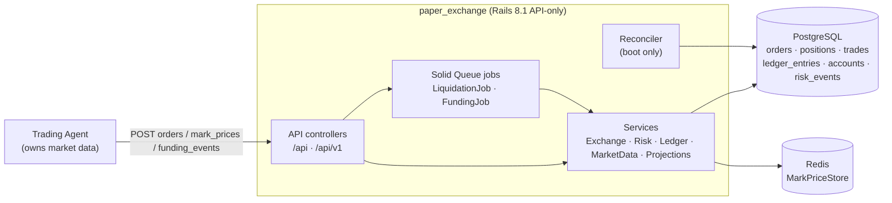
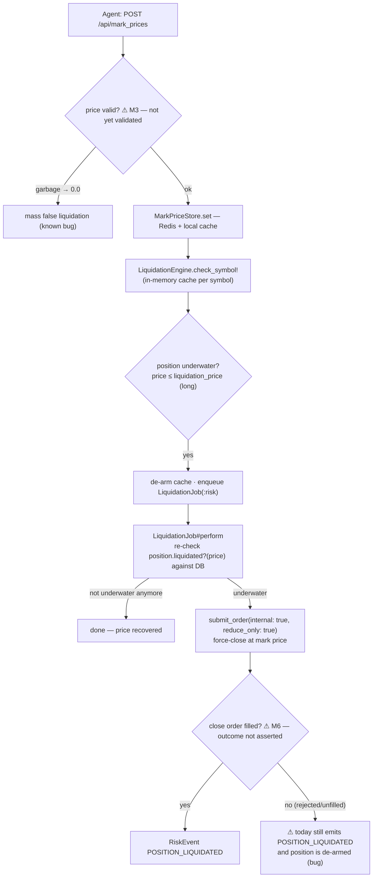

# Architecture — paper_exchange

> **Primary reader:** AI developer. Last updated: 2026-09-25. Verified against the codebase (Rails 8.1.3).
> Companion files: `prd.md` (what/why) · `rules.md` (coding constraints) · `memory.md` (decisions & known issues). Full defect list with file:line evidence: `REVIEW.md`.

---

## 1. Tech stack

| Layer | Choice | Notes |
|-------|--------|-------|
| Language | Ruby (≥ 3.2, Rails 8.1.3) | API-only mode (`ActionController::API`) |
| Web | Puma 6.4 + Thruster | `config/puma.rb` |
| DB | PostgreSQL | money columns are `decimal(36,18)` |
| Cache / prices | Redis | `MarketData::MarkPriceStore` (Redis + process-local cache) |
| Jobs | Solid Queue (DB-backed) | `config/queue.yml`, `config/recurring.yml`; queues incl. `:risk` |
| App cache | Solid Cache (DB-backed) | Rails 8.1 default stack |
| JSON | Oj | |
| Validation | dry-validation | `Exchange::OrderValidator` |
| HTTP clients | Faraday + faraday-retry | used by instrument catalogs (timeouts pending — S12) |
| Exchange gems | DhanHQ 3.4, coindcx-client 0.1.0 | **instrument catalogs only** — never order routing |
| ⚠ Present but unused | sidekiq | adapter is Solid Queue everywhere; removal tracked (T4.2) |
| Test | RSpec, FactoryBot, VCR/WebMock, shoulda-matchers, SimpleCov, bullet, rack-mini-profiler | |
| Static analysis | Brakeman, bundler-audit, RuboCop (rails-omakase) | `bin/ci` runs the local CI suite (`config/ci.rb`) |
| Deploy | Docker + Kamal 2 (`config/deploy.yml`), dotenv-rails | |
| Cross-language tests | TypeScript smoke suites (`smoke-test.ts`, `smoke-test-simulation.ts`) | run against Docker; executable invariants table |

## 2. Folder structure (annotated)

```
paper_exchange/
├── app/
│   ├── controllers/
│   │   ├── application_controller.rb        # ActionController::API base
│   │   └── api/                             # ALL HTTP endpoints
│   │       ├── base_controller.rb           # set_account (X-Account-Id header), render_error
│   │       ├── accounts_controller.rb       # GET account · POST account/reset  (⚠ inherits ApplicationController — S8)
│   │       ├── orders_controller.rb         # orders CRUD (create = the money path entry)
│   │       ├── positions_controller.rb      # index OK · show ⚠ always 404 (M7)
│   │       ├── ledger_controller.rb         # GET ledger (cap 500)
│   │       ├── risk_events_controller.rb    # GET risk_events (cap 200)
│   │       ├── performance_controller.rb    # GET performance
│   │       ├── mark_prices_controller.rb    # POST mark_prices — bulk push (⚠ unvalidated — M3)
│   │       └── funding_events_controller.rb # POST funding_events (⚠ unvalidated — M3)
│   ├── jobs/                                # Solid Queue
│   │   ├── liquidation_job.rb               # queue :risk — force-close underwater positions
│   │   └── funding_job.rb                   # per-position funding settlement (idempotent)
│   ├── models/
│   │   ├── account.rb                       # wallet: balance, locked_margin, cached equity/PnL
│   │   ├── ledger_entry.rb                  # append-only ledger row (credit/debit/event_type/payload)
│   │   ├── risk_event.rb                    # risk & liquidation audit trail
│   │   ├── funding_payment.rb               # funding settlements; dedup (position, funding_time)
│   │   ├── option_snapshot.rb · market_structure_snapshot.rb
│   │   └── paper_exchange/                  # namespaced trading models (tables paper_exchange_*)
│   │       ├── paper_order.rb               # enum status machine (⚠ unguarded — S1)
│   │       ├── paper_position.rb            # contract-scoped position, liquidated?(price)
│   │       └── paper_trade.rb               # fills (charges, PnL)
│   └── services/
│       ├── exchange/                        # THE ENGINE
│       │   ├── paper_exchange.rb            # ★ facade — submit_order is the money path (read first)
│       │   ├── order_validator.rb           # dry-validation schema → OrderValidationError (422)
│       │   ├── matching_engine.rb           # order → [:filled|:unfilled|:rejected, qty, price]
│       │   ├── fill_engine.rb               # fill execution; exact_price bypasses slippage
│       │   ├── position_manager.rb          # position upsert (⚠ lost-update race — M4)
│       │   ├── margin_engine.rb             # position-level margin sync (⚠ same race — S6)
│       │   ├── order_book.rb                # in-memory book w/ Redis (MarkPriceStore) fallback
│       │   ├── slippage_engine.rb · latency_engine.rb   # simulation knobs
│       │   ├── liquidation_calculator.rb    # liquidation-price math
│       │   ├── brokerage_calculator.rb      # Indian F&O charges (STT/GST/SEBI/stamp)
│       │   └── *_instrument_catalog.rb      # Dhan / coindcx / Binance USDM / crypto catalogs
│       ├── ledger/
│       │   ├── margin_ledger.rb             # ALL wallet movements, under Account row lock
│       │   ├── ledger.rb                    # entries, realized PnL, cached equity refresh
│       │   └── reconciler.rb                # boot-time wallet rebuild from ledger + cache re-arm
│       ├── risk/
│       │   ├── risk_manager.rb              # runs validators (⚠ fail-open — M5)
│       │   ├── margin_validator.rb · max_drawdown_validator.rb
│       │   ├── position_limit_validator.rb · vix_gate_validator.rb
│       │   ├── liquidation_engine.rb        # in-memory cache; enqueues LiquidationJob
│       │   └── vix_gate.rb                  # ⚠ superseded by vix_gate_validator — unwired
│       ├── market_data/
│       │   ├── mark_price_store.rb          # Redis write-through + process-local cache
│       │   └── (tick_processor, candle_builder, greeks_service,
│       │       option_chain_service, market_event, trade_event)   # ⚠ UNWIRED (S7)
│       ├── projections/                     # read-side: position_portfolio_performance
│       └── strategy/                        # ⚠ ENTIRE NAMESPACE UNWIRED (S7) — do not depend on it
├── config/
│   ├── routes.rb                            # /api and /api/v1 (both), snake+kebab path aliases
│   ├── queue.yml · recurring.yml · cache.yml# Solid Queue / Cache
│   ├── deploy.yml                           # Kamal
│   ├── ci.rb                                # local CI entry (bin/ci)
│   └── initializers/
│       ├── reconciler.rb                    # runs Reconciler at boot (skipped in test)
│       ├── cors.rb                          # ⚠ origins "*" (N5)
│       └── exchange_catalogs_loader.rb      # ⚠ explicit requires + loader unregister (S10)
├── db/                                      # schema.rb + 18 migrations (2025-06 → 2026-09)
├── spec/                                    # 53 spec files, ~213 examples (see REVIEW.md §Testing)
├── smoke-test.ts · smoke-test-simulation.ts # TS invariant suites (Docker target, not in CI)
├── Dockerfile · docker-compose.yml · .env.example
└── prd.md · architecture.md · rules.md · design.md · tasks.md · memory.md · REVIEW.md
```

## 3. Runtime topology



**Key boundary fact:** there is no auth between agent and API (audit M2). The agent is trusted; the deployment boundary (loopback / private network) is the current security boundary. See `prd.md` §3 and `tasks.md` T1.2.

## 4. Order lifecycle — the money path

`POST /api/orders` → `OrdersController#create` → `Exchange::PaperExchange#submit_order` (`app/services/exchange/paper_exchange.rb`). **This method is the heart of the system — read it before touching anything in `exchange/`.**

```mermaid
sequenceDiagram
    participant A as Agent
    participant C as OrdersController
    participant X as PaperExchange#submit_order
    participant V as OrderValidator (dry-validation)
    participant L as Ledger::MarginLedger
    participant R as Risk::RiskManager
    participant M as MatchingEngine → FillEngine
    participant P as PositionManager → MarginEngine
    participant DB as PostgreSQL

    A->>C: POST /api/orders (client_order_id, execution_price…)
    C->>X: submit_order(attrs)
    X->>DB: idempotency pre-check on (account_id, client_order_id)
    X->>V: validate → typed attrs (raises OrderValidationError → 422)
    X->>DB: order.save! (rescue RecordNotUnique → replay idempotent twin)
    rect rgb(235, 235, 245)
        note over X,DB: H1 — one transaction: lock + risk + fill are atomic;<br/>any raise rolls back the margin lock too
        X->>DB: order.open!
        X->>L: lock_margin! (Account row FOR UPDATE) → order.locked_margin
        X->>R: evaluate(account, signal)
        R-->>X: [passed, rejected symbols]
        alt rejected (*_REJECTED) — ⚠ M5: events rolled back today
            X->>DB: raise → ROLLBACK
        else passed
            X->>M: execute(order) → [fill_qty, fill_price]
            X->>P: PositionManager.apply! (position upsert — ⚠ M4 race)
            X->>L: record_trade + fees + realized PnL (crypto perps)
            X->>L: release_order_margin! (superseded by position margin)
            X->>DB: COMMIT → order.filled!
        end
    end
    C-->>A: 201 + order JSON
```

**Gates bypass rule (intentional, do not "fix"):** `internal: true` and `reduce_only: true` orders skip the margin lock and risk gate. This is the B3 fix — a liquidation force-close on an underwater account would otherwise always fail its own margin check and deadlock forever. See `memory.md` §Decisions.

**Reduce-only two-phase clamp:** advisory pre-check (`clamp_to_position`, no lock, cheap 422) then authoritative re-read under row lock inside the transaction (`clamp_order_to_locked_position!`). A reduce-only order can never grow or flip a position.

## 5. Liquidation pipeline



Cache lifecycle caveat: the liquidation cache is rebuilt only on mark-price pushes and at boot (Reconciler re-arms it). A leveraged position opened *after* the last push for its symbol is unmonitored until the next push (documented trade-off, N9).

## 6. Ledger & reconciliation (the trust primitive)

- **All wallet movements** go through `Ledger::MarginLedger` (`lock_margin!`, `unlock_margin!`, `deduct_fee!`, `credit_realized_pnl!`) — each takes `Account.lock` (`SELECT … FOR UPDATE`), raises `InsufficientMarginError` on shortfall, clamps unlocks to the currently locked amount, and writes a paired **append-only `LedgerEntry`**.
- **`Ledger::Reconciler`** runs at boot (`config/initializers/reconciler.rb`, skipped in test): rebuilds wallet state from the ledger, corrects drift with visible `ADJUSTMENT` entries, re-arms the liquidation cache.
- **Idempotency everywhere money moves:** `client_order_id` unique index + rescue-replay (orders); `(paper_position_id, funding_time)` partial unique index (funding).
- Invariant to preserve at all times: **wallet balance == Σ ledger entries**.

## 7. Key modules & ownership

| Module | Responsibility | Entry point |
|--------|----------------|-------------|
| `Api::*Controllers` | HTTP ⇄ service translation, error mapping (400/402/404/422/500), account resolution from headers | `orders_controller.rb` |
| `Exchange::PaperExchange` | Facade & money-path orchestrator: idempotency, gates, transaction boundary | `submit_order` |
| `Exchange::OrderValidator` | dry-validation of ALL external order input | `.call` |
| `Exchange::Matching/Fill/Slippage/Latency` | Fill decision & simulation | `matching_engine.rb`, `fill_engine.rb` |
| `Exchange::PositionManager` | Contract-scoped position upsert (avg price, side flip) | `.apply!` |
| `Exchange::MarginEngine` | Position-level initial-margin sync after fills | `.sync_position!` |
| `Ledger::*` | Wallet + entries + boot reconciliation | `margin_ledger.rb`, `reconciler.rb` |
| `Risk::*` | Pre-trade validators + liquidation engine/cache | `risk_manager.rb`, `liquidation_engine.rb` |
| `MarketData::MarkPriceStore` | Redis-backed mark prices (+process-local cache) | `.set/.get` |
| `Projections::*` | Read-side projections for positions/portfolio/performance | `portfolio_projection.rb` |
| `Strategy::*` + parts of `MarketData::*` | ⚠ **Unwired scaffolding** — no runtime callers (audit S7). Do not add dependencies on them. | — |

## 8. Known architectural debt (summary — full detail in REVIEW.md)

1. **M-class (must-fix):** committed master key (M1) · no auth (M2) · unvalidated price/funding input (M3) · position race + NULL-unsafe unique index (M4) · fail-open risk gate + rolled-back rejection events (M5) · false liquidation success (M6) · broken `positions#show` (M7).
2. **Structural:** ~⅓ of `app/services` is unreachable from runtime (S7) · per-request `PaperExchange` instances make the in-memory book/mutex request-scoped (S15) · Zeitwerk fought with explicit requires & late inflections (S10).
3. **Config drift:** documented env var `PAPER_EXCHANGE_MAX_DRAWDOWN` does nothing (code reads `PAPER_EXCHANGE_MAX_DD` — S9) · `database.yml` uses non-existent `max_connections` key (S13).

**Rule of thumb for the AI:** before changing anything on the money path (`submit_order`, `PositionManager`, `MarginLedger`, `MarginEngine`), read `rules.md` §Money & §Concurrency — several "obvious simplifications" there are load-bearing race fixes.
