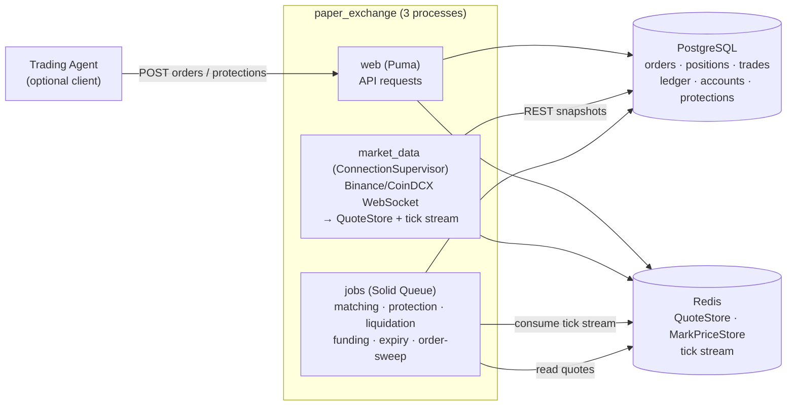
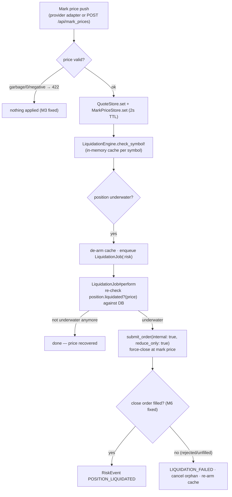
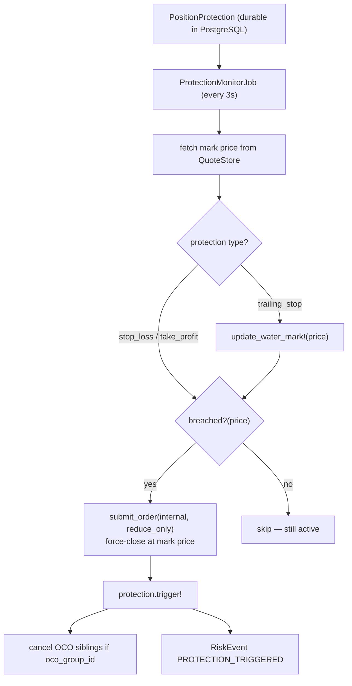

# Architecture — paper_exchange

> **Primary reader:** AI developer. Last updated: 2026-10-10. Verified against the codebase (Rails 8.1.3 + autonomous exchange architecture).
> Companion files: `prd.md` (what/why) · `rules.md` (coding constraints) · `memory.md` (decisions & known issues) · `PRODUCTION_READINESS.md` (hardening report).

---

## 1. Tech stack

| Layer | Choice | Notes |
|-------|--------|-------|
| Language | Ruby (≥ 3.2, Rails 8.1.3) | API-only mode (`ActionController::API`) |
| Web | Puma 8.0 + Thruster | `config/puma.rb` |
| DB | PostgreSQL | money columns are `decimal(36,18)` |
| Cache / prices | Redis | `MarketData::QuoteStore` (venue-aware) + `MarkPriceStore` (legacy, with 2s TTL) |
| Jobs | Solid Queue (DB-backed) | `config/queue.yml`, `config/recurring.yml`; queues incl. `:risk`, `:default` |
| App cache | Solid Cache (DB-backed) | Rails 8.1 default stack |
| JSON | Oj | |
| Validation | dry-validation | `Exchange::OrderValidator` |
| HTTP clients | Faraday + faraday-retry | used by instrument catalogs (timeouts: open=2s, read=5s) |
| Exchange gems | DhanHQ 3.4, coindcx-client 1.0, binance-client 0.1 | provider adapters wrap public market-data methods — never order routing |
| Test | RSpec, FactoryBot, VCR/WebMock, shoulda-matchers, SimpleCov, bullet, rack-mini-profiler | |
| Static analysis | Brakeman, bundler-audit, RuboCop (rails-omakase) | `bin/ci` runs the local CI suite |
| Deploy | Docker (3-process topology) + Kamal 2 (`config/deploy.yml`), dotenv-rails | web / jobs / market_data |
| Cross-language tests | TypeScript smoke suites (`smoke-test.ts`, `smoke-test-simulation.ts`) | run against Docker; executable invariants table |

## 2. Folder structure (annotated)

```
paper_exchange/
├── app/
│   ├── controllers/
│   │   ├── application_controller.rb        # ActionController::API base
│   │   ├── health_controller.rb             # GET /health — deep probe (Postgres+Redis+SolidQueue)
│   │   └── api/                             # ALL HTTP endpoints
│   │       ├── base_controller.rb           # auth (X-API-Key), set_account, global rescue_from
│   │       ├── accounts_controller.rb       # GET account · POST account/reset
│   │       ├── orders_controller.rb         # orders CRUD (create = the money path entry)
│   │       ├── positions_controller.rb      # index · show
│   │       ├── protections_controller.rb    # POST/GET/DELETE positions/:id/protections (SL/TP/trailing/OCO)
│   │       ├── ledger_controller.rb         # GET ledger (keyset paginated)
│   │       ├── risk_events_controller.rb    # GET risk_events (keyset paginated)
│   │       ├── performance_controller.rb    # GET performance
│   │       ├── exchange_controller.rb       # GET exchange/status — provider health + quote freshness
│   │       ├── mark_prices_controller.rb    # POST mark_prices — bulk push (validated, 503 on Redis outage)
│   │       ├── funding_events_controller.rb # POST funding_events (validated)
│   │       ├── market_events_controller.rb  # POST/GET market_events — Redis tick stream
│   │       ├── market_structure_controller.rb
│   │       └── strategy_controller.rb       # POST strategy/signals — pre-trade risk assessment
│   ├── jobs/                                # Solid Queue
│   │   ├── application_job.rb               # retry_on Deadlocked · discard_on DeserializationError
│   │   ├── liquidation_job.rb              # queue :risk — force-close underwater positions
│   │   ├── funding_job.rb                  # per-position funding settlement (atomic + idempotent)
│   │   ├── expire_orders_job.rb             # sweep open orders older than TTL
│   │   ├── matching_worker_job.rb           # autonomous matching (every 2s)
│   │   ├── protection_monitor_job.rb        # autonomous SL/TP monitoring (every 3s)
│   │   └── option_expiry_job.rb             # daily option expiry settlement (15:30)
│   ├── models/
│   │   ├── account.rb                       # wallet: balance, locked_margin, cached equity/PnL, max_equity_achieved
│   │   ├── ledger_entry.rb                  # append-only ledger row (immutable: readonly? + DB trigger)
│   │   ├── risk_event.rb                    # risk & liquidation audit trail
│   │   ├── funding_payment.rb               # funding settlements; dedup (position, funding_time)
│   │   ├── position_protection.rb          # durable SL/TP/trailing_stop/OCO policies
│   │   ├── option_snapshot.rb · market_structure_snapshot.rb
│   │   └── paper_exchange/                  # namespaced trading models (tables paper_exchange_*)
│   │       ├── paper_order.rb               # enum status machine (guarded transitions, venue column)
│   │       ├── paper_position.rb            # contract-scoped position, venue column, liquidated?(price)
│   │       └── paper_trade.rb               # fills (charges, PnL)
│   └── services/
│       ├── exchange/                        # THE ENGINE
│       │   ├── paper_exchange.rb            # ★ facade — submit_order + match_and_fill (autonomous)
│       │   ├── matching_worker.rb           # ★ event-driven matching (consumes Redis tick stream)
│       │   ├── order_validator.rb           # dry-validation schema → OrderValidationError (422)
│       │   ├── matching_engine.rb           # order → fill (limit price improvement, stop-market)
│       │   ├── fill_engine.rb               # fill execution; exact_price bypasses slippage
│       │   ├── position_manager.rb          # position upsert (row lock + savepoint + retry)
│       │   ├── margin_engine.rb              # position-level margin sync (full notional for leverage-1)
│       │   ├── order_book.rb                # in-memory book w/ Redis fallback
│       │   ├── slippage_engine.rb · latency_engine.rb   # simulation knobs
│       │   ├── liquidation_calculator.rb    # liquidation-price math
│       │   ├── brokerage_calculator.rb      # Indian F&O charges (NSE FY2026-27 STT schedule)
│       │   └── *_instrument_catalog.rb      # Dhan / coindcx / Binance USDM / crypto catalogs
│       ├── ledger/
│       │   ├── margin_ledger.rb             # ALL wallet movements, under Account row lock
│       │   ├── ledger.rb                    # entries, realized PnL (from REALIZED_PNL stream), equity
│       │   └── reconciler.rb                # boot-time wallet rebuild (fatal in production)
│       ├── risk/
│       │   ├── risk_manager.rb              # runs validators (fails closed)
│       │   ├── margin_validator.rb          # notional + available balance check (one reference price)
│       │   ├── max_drawdown_validator.rb    # drawdown from equity HWM (live, not cached)
│       │   ├── position_limit_validator.rb · vix_gate_validator.rb · currency_validator.rb
│       │   └── liquidation_engine.rb        # in-memory cache; enqueues LiquidationJob
│       ├── market_data/
│       │   ├── quote_store.rb               # ★ venue-aware shared quote store (Redis, bid/ask/mark/funding)
│       │   ├── mark_price_store.rb          # legacy mark price store (2s TTL, mirrors to QuoteStore)
│       │   ├── tick_processor.rb            # capped Redis tick stream (~100k entries)
│       │   ├── connection_supervisor.rb     # ★ long-lived market-data process skeleton
│       │   ├── market_event.rb · trade_event.rb
│       │   ├── candle_builder.rb · greeks_service.rb · option_chain_service.rb  # Roadmap — not wired
│       │   └── providers/                   # ★ provider adapter framework
│       │       ├── base.rb                  # common contract (fetch_instruments, connect, health, disconnect)
│       │       ├── binance_usdm.rb          # Binance USD-M REST + WebSocket adapter
│       │       └── coindcx_futures.rb        # CoinDCX futures adapter
│       ├── projections/                     # read-side: position/portfolio/performance
│       └── strategy/                        # strategy engine, indicators, market structure, option selector
├── config/
│   ├── routes.rb                            # /api and /api/v1; positions have nested protections
│   ├── queue.yml · recurring.yml · cache.yml# Solid Queue / Cache; recurring jobs scheduled
│   ├── deploy.yml                           # Kamal
│   ├── ci.rb                                # local CI entry (bin/ci)
│   ├── environments/production.rb           # force_ssl, config.hosts, assume_ssl
│   └── initializers/
│       ├── reconciler.rb                    # runs Reconciler at boot (fatal in production)
│       ├── api_authentication.rb            # boot-fail if PAPER_EXCHANGE_API_KEY missing
│       ├── cors.rb                          # loopback-only origins
│       └── exchange_catalogs_loader.rb      # Zeitwerk inflections (S10 pending)
├── db/                                      # schema.rb + migrations (2025-06 → 2026-10)
├── bin/
│   ├── market_data                          # ★ standalone market-data supervisor entrypoint
│   ├── jobs · ci · rails · setup
│   └── docker-entrypoint
├── spec/                                    # ~75 spec files (models, services, integration, jobs)
├── smoke-test.ts · smoke-test-simulation.ts # TS invariant suites (Docker target, not in CI)
├── Dockerfile · docker-compose.yml · .env.example
└── prd.md · architecture.md · rules.md · design.md · tasks.md · memory.md · REVIEW.md · PRODUCTION_READINESS.md
```

## 3. Runtime topology (3-process)

PaperExchange runs as **three independently supervised processes** sharing PostgreSQL + Redis:


```mermaid
flowchart LR
    AG["Trading Agent<br/>(optional client)"]
    subgraph PX["paper_exchange (3 processes)"]
        WEB["web (Puma)<br/>API requests"]
        JOBS["jobs (Solid Queue)<br/>matching · protection · liquidation<br/>funding · expiry · order-sweep"]
        MD["market_data (ConnectionSupervisor)<br/>Binance/CoinDCX WebSocket<br/>→ QuoteStore + tick stream"]
    end
    PG[("PostgreSQL<br/>orders · positions · trades<br/>ledger · accounts · protections")]
    RD[("Redis<br/>QuoteStore · MarkPriceStore<br/>tick stream")]

    AG -->|"POST orders / protections"| WEB
    WEB --> PG
    WEB --> RD
    MD --> RD
    MD -->|"REST snapshots"| PG
    JOBS --> PG
    JOBS -->|"consume tick stream"| RD
    JOBS -->|"read quotes"| RD
```

| Process | Responsibility | Restarts independently? |
|---------|----------------|--------------------------|
| `web` | API requests (Puma) | Yes |
| `jobs` | Solid Queue workers: MatchingWorker (2s), ProtectionMonitor (3s), LiquidationJob, FundingJob, ExpireOrdersJob (5m), OptionExpiryJob (daily) | Yes |
| `market_data` | ConnectionSupervisor: Binance/CoinDCX WebSocket, REST bootstrap, event normalization → QuoteStore + tick stream | Yes (behind `--profile market_data`) |

**Key design rule (target architecture):** the trading bot is an **optional command client**. When it goes offline, market data continues arriving, working orders continue to be evaluated, SL/TP protections continue to trigger, liquidation and funding workers continue to operate, and the account/fills/ledger remain queryable when the bot reconnects.

## 4. Order lifecycle — the money path

`POST /api/orders` → `OrdersController#create` → `Exchange::PaperExchange#submit_order`. **This method is the heart of the system — read it before touching anything in `exchange/`.**

```mermaid
sequenceDiagram
    participant A as Agent
    participant C as OrdersController
    participant X as PaperExchange#submit_order
    participant V as OrderValidator (dry-validation)
    participant L as Ledger::MarginLedger
    participant R as Risk::RiskManager
    participant M as MatchingEngine → FillEngine
    participant P as PositionManager → MarginEngine
    participant DB as PostgreSQL

    A->>C: POST /api/orders (client_order_id, execution_price…)
    C->>X: submit_order(attrs)
    X->>DB: idempotency pre-check on (account_id, client_order_id)
    X->>V: validate → typed attrs (raises OrderValidationError → 422)
    X->>X: P1-2: build one authoritative reference_price (execution_price || price || ltp)
    X->>DB: order.save! (rescue RecordNotUnique → replay idempotent twin)
    rect rgb(235, 235, 245)
        note over X,DB: H1 — one transaction: lock + risk + fill are atomic;<br/>any raise rolls back the margin lock too
        X->>DB: order.open!
        X->>L: lock_margin! (Account row FOR UPDATE) → order.locked_margin
        X->>R: evaluate(account, signal) — uses reference_price for notional check
        R-->>X: [passed, rejected symbols] (fails closed on error)
        alt rejected (*_REJECTED) — events persisted post-rollback (M5 fixed)
            X->>DB: raise → ROLLBACK
            X->>DB: RiskEvent.create! (*_REJECTED) — post-rollback rescue
        else passed
            X->>M: execute(order) → [fill_qty, fill_price] (limit price improvement P2-1)
            X->>P: PositionManager.apply! (position upsert under row lock — M4 fixed)
            X->>L: release_order_margin! (superseded by position margin)
            X->>P: MarginEngine.sync_position! (full notional for leverage-1 — P0-1)
            X->>L: record_trade (posts REALIZED_PNL + FEE via MarginLedger — P0-1)
            X->>DB: COMMIT → order.filled!
        end
    end
    C-->>A: 201 + order JSON
```

**Autonomous matching path (target architecture):** when a market event arrives (via the `market_data` process or `POST /api/market_events`), the `MatchingWorker` consumes it from the Redis tick stream, updates `QuoteStore`, scans open orders, and calls `PaperExchange#match_and_fill` to fill marketable orders at the live book price. This path bypasses the risk gate (margin was already locked at submit time) but runs the same fill + position + ledger sequence under a row lock.

## 5. Liquidation pipeline


```mermaid
flowchart TD
    A["Mark price push<br/>(provider adapter or POST /api/mark_prices)"] --> B{"price valid?"}
    B -- "garbage/0/negative → 422" --> B1["nothing applied (M3 fixed)"]
    B -- ok --> C["QuoteStore.set + MarkPriceStore.set (2s TTL)"]
    C --> D["LiquidationEngine.check_symbol!<br/>(in-memory cache per symbol)"]
    D --> E{"position underwater?"}
    E -- yes --> F["de-arm cache · enqueue LiquidationJob(:risk)"]
    F --> G["LiquidationJob#perform<br/>re-check position.liquidated?(price) against DB"]
    G -- "not underwater anymore" --> I["done — price recovered"]
    G -- underwater --> J["submit_order(internal: true, reduce_only: true)<br/>force-close at mark price"]
    J --> K{"close order filled? (M6 fixed)"}
    K -- yes --> L["RiskEvent POSITION_LIQUIDATED"]
    K -- "no (rejected/unfilled)" --> M["LIQUIDATION_FAILED · cancel orphan · re-arm cache"]
```

## 6. Position protection pipeline (autonomous)


```mermaid
flowchart TD
    P["PositionProtection (durable in PostgreSQL)"] --> PM["ProtectionMonitorJob (every 3s)"]
    PM --> Q["fetch mark price from QuoteStore"]
    Q --> T{"protection type?"}
    T -- "trailing_stop" --> WM["update_water_mark!(price)"]
    T -- "stop_loss / take_profit" --> BR{"breached?(price)"}
    WM --> BR
    BR -- yes --> FC["submit_order(internal, reduce_only)<br/>force-close at mark price"]
    FC --> TG["protection.trigger!"]
    TG --> OCO["cancel OCO siblings if oco_group_id"]
    TG --> RE["RiskEvent PROTECTION_TRIGGERED"]
    BR -- no --> SKIP["skip — still active"]
```

## 7. Ledger & reconciliation (the trust primitive)

- **All wallet movements** go through `Ledger::MarginLedger` (`lock_margin!`, `unlock_margin!`, `deduct_fee!`, `credit_realized_pnl!`) — each takes `Account.lock` (`SELECT … FOR UPDATE`), raises `InsufficientMarginError` on shortfall, clamps unlocks to the currently locked amount, and writes a paired **append-only `LedgerEntry`**.
- **P0-1 accounting model:** equity = `available_balance + locked_margin + unrealized_pnl`. Locked margin includes the full notional of all open positions (leverage-1 included). Realized PnL is posted via `credit_realized_pnl!` on every closing fill (both crypto and non-crypto) and sourced from the `REALIZED_PNL` ledger stream — not from a re-derivation against mutable position state.
- **`Ledger::Reconciler`** runs at boot (fatal in production — a failed reconcile means the wallet invariant is broken and the deploy should fail). Rebuilds wallet state from the ledger, corrects drift with visible `ADJUSTMENT` entries, re-arms the liquidation cache.
- **Idempotency everywhere money moves:** `client_order_id` unique index + rescue-replay (orders); `(paper_position_id, funding_time)` partial unique index (funding); `(position, funding_time)` transactional in `FundingJob` (P0-2 — payment + ledger are atomic).
- Invariant to preserve at all times: **wallet balance == Σ ledger entries**.

## 8. Key modules & ownership

| Module | Responsibility | Entry point |
|--------|----------------|-------------|
| `Api::*Controllers` | HTTP ⇄ service translation, error mapping, account resolution | `orders_controller.rb` |
| `Exchange::PaperExchange` | Facade: idempotency, gates, transaction boundary, `match_and_fill` | `submit_order`, `match_and_fill` |
| `Exchange::MatchingWorker` | Autonomous matching: consumes tick stream, fills open orders | `process_tick` |
| `Exchange::OrderValidator` | dry-validation of ALL external order input | `.call` |
| `Exchange::Matching/Fill/Slippage/Latency` | Fill decision & simulation (limit price improvement P2-1) | `matching_engine.rb` |
| `Exchange::PositionManager` | Contract-scoped position upsert (row lock + retry) | `.apply!` |
| `Exchange::MarginEngine` | Position-level margin sync (full notional for leverage-1, P0-1) | `.sync_position!` |
| `Ledger::*` | Wallet + entries + boot reconciliation (fatal in production) | `margin_ledger.rb`, `reconciler.rb` |
| `Risk::*` | Pre-trade validators (incl. CurrencyValidator P1-6) + liquidation | `risk_manager.rb` |
| `Risk::MaxDrawdownValidator` | Drawdown from equity high-water mark (live, P1-1) | `max_drawdown_validator.rb` |
| `MarketData::QuoteStore` | Venue-aware shared quote store (Redis, bid/ask/mark/funding) | `.set/.get` |
| `MarketData::MarkPriceStore` | Legacy mark price store (2s TTL P2-3, mirrors to QuoteStore) | `.set/.get` |
| `MarketData::ConnectionSupervisor` | Long-lived market-data process (WebSocket, REST bootstrap) | `start` |
| `MarketData::Providers::*` | Binance/CoinDCX adapter framework | `base.rb` |
| `PositionProtection` | Durable SL/TP/trailing/OCO policies | model |
| `ProtectionMonitorJob` | Autonomous protection monitoring (every 3s) | `perform` |
| `OptionExpiryJob` | Daily option expiry settlement (cash settlement) | `perform` |
| `Projections::*` | Read-side: position/portfolio/performance (REALIZED_PNL stream, P1-4) | `portfolio_projection.rb` |
| `Strategy::*` | Pre-trade assessment (`POST /api/strategy/signals`); indicator compute still Roadmap | `strategy_engine.rb` |

## 9. Accounting model (P0-1 fix)

The system uses a **unified margin-wallet model** for both cash instruments and leveraged crypto perps:

- **Purchase (buy):** `lock_margin!` locks the full notional (leverage-1) or notional/leverage (leveraged) against `available_balance`. `available_balance` decreases; `locked_margin` increases.
- **Sale (sell to close):** `sync_position!` releases the position's `initial_margin` back to `available_balance`. Realized PnL is posted via `credit_realized_pnl!` (gain) or `deduct_fee!` (loss).
- **Equity formula:** `available_balance + locked_margin + unrealized_pnl`. This is correct for both models because the capital tied up in holdings is always in `locked_margin`.
- **Realized PnL:** sourced from the `REALIZED_PNL` ledger stream, posted at fill time by `Ledger::Ledger.record_trade`. The `TRADE` ledger entries are audit records only — they do not affect the equity calculation (P0-1: the old `trade_cash_pnl` term double-counted the purchase cost).

## 10. Known architectural debt

1. **Zeitwerk normalization (S10):** inflections still in `config/application.rb` `after_initialize` instead of `config/initializers/inflections.rb`; self-alias on `BinanceUsdmFuturesCatalog` still present.
2. **Per-request `PaperExchange` instances (S15):** `@books`/`@mutex` are per-instance; the autonomous `MatchingWorker` creates its own instance per tick. A singleton or stateless extraction would be cleaner.
3. **Indicator/candle/greeks roadmap:** `IndicatorEngine` compute, `CandleBuilder`, `GreeksService`, `OptionChainService`, `OptionSelector` exist but have no runtime callers.
4. **Rate limiting / metrics / structured logging:** documented in `PRODUCTION_READINESS.md` — needs a gem/lockfile change to verify.
5. **Depth-consuming partial fills:** the matching engine fills the entire remaining quantity without consuming recorded order-book depth.
